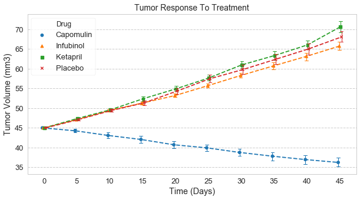
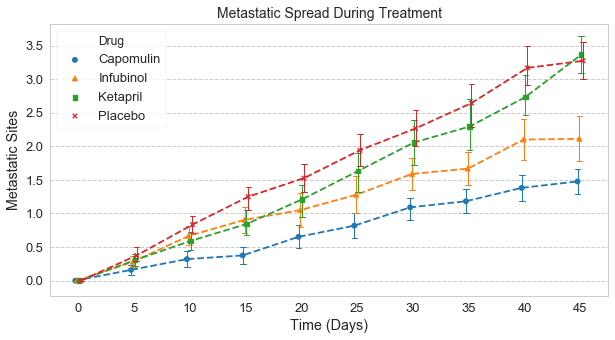
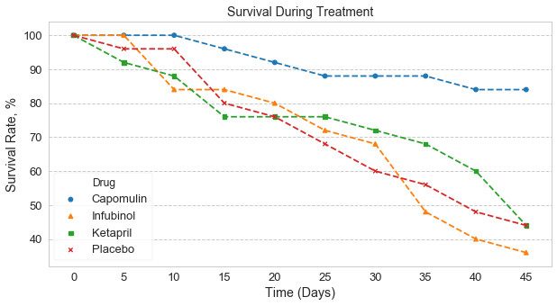
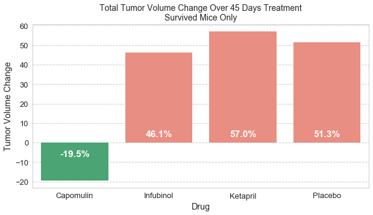
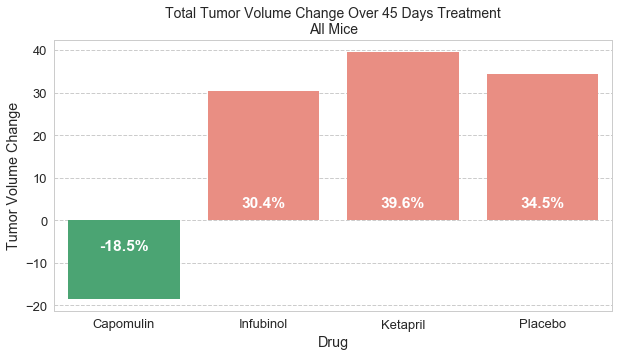

# Observations
 - Capomulin was the only drug which resulted in reduction of tumor volume and slowed metastatic spread, in comparison to a Placebo. Infubinol and Ketapril showed results which were not better or were worse than Placebo.
 - Reduction, as well as enlargement of tumor volume was consistent among all mice with same group (treated by the same drug), as indicated by small standard errors of the means for all days of observations (the data appears to be somehow normalized as all observations for drugs in focus start with 45mm3)


```python
import pandas as pd
import matplotlib.pyplot as plt
import os
import seaborn as sns

ct_path = os.path.join("raw_data","clinicaltrial_data.csv")
m_path=os.path.join("raw_data","mouse_drug_data.csv")

# Import the CSV into a pandas DataFrame
ct_df = pd.read_csv(ct_path, low_memory=False)
m_df= pd.read_csv(m_path, low_memory=False)

```


```python
drug_arr=["Capomulin","Infubinol","Ketapril","Placebo"]
m_ct_df=pd.merge(m_df.loc[m_df["Drug"].isin(drug_arr),:],ct_df,how='inner',on='Mouse ID').rename(columns={"Timepoint": "Time (Days)"})
```


```python
# set style for Seaborn charts 
sns.set_context("notebook", font_scale=1.3, rc={"lines.linewidth": 1})
sns.set_style("whitegrid", {'axes.linewidth': 1.0, 'legend.frameon': True, 'grid.linestyle': u'--',  'legend.scatterpoints': 1})
markers_arr=['o','^','s','x']
```

# Time Series

Charts below provide the mean timeseries for each drug based on mice treatment timeseries data, along with bars representing the standard error of the mean for each time point and drug.


```python
plt1=sns.pointplot(x="Time (Days)", y="Tumor Volume (mm3)",hue="Drug", hue_order=drug_arr, data=m_ct_df, ci=68, markers=markers_arr,linestyles='--', errwidth=1,capsize=0.1, dodge=True)
plt1.figure.set_size_inches(10,5)
plt1.axes.set_title('Tumor Response To Treatment', fontsize=14)
```


    Text(0.5,1,'Tumor Response To Treatment')





```python
plt1=sns.pointplot(x="Time (Days)", y="Metastatic Sites",hue="Drug", hue_order=drug_arr, data=m_ct_df, ci=68, markers=markers_arr,linestyles='--', errwidth=1,capsize=0.1, dodge=True)
plt1.figure.set_size_inches(10,5)
plt1.axes.set_title('Metastatic Spread During Treatment', fontsize=14)
```


    Text(0.5,1,'Metastatic Spread During Treatment')





```python
# generate survival rate data
m_ct_df_grouped=m_ct_df.groupby(by=["Drug","Time (Days)"])
m_ct_df_surv_count=m_ct_df_grouped.count()[["Mouse ID"]]
m_ct_df_surv_count=m_ct_df_surv_count.rename(columns={"Mouse ID":"Mice Survived"})
initial_mouse_count=m_ct_df_surv_count.groupby(by="Drug").max().rename(columns={"Mice Survived":"Initial Mice Count"})
m_ct_df_surv_count=pd.merge(m_ct_df_surv_count,initial_mouse_count,left_index=True,right_index=True)
m_ct_df_surv_count["Survival Rate, %"]=100*m_ct_df_surv_count["Mice Survived"]/m_ct_df_surv_count["Initial Mice Count"]
```

The plot below provides the survival rate timeseries for each drug.


```python
plt1=sns.pointplot(x="Time (Days)", y="Survival Rate, %",hue="Drug", hue_order=drug_arr, data=m_ct_df_surv_count.reset_index(), markers=markers_arr,linestyles='--')
plt1.figure.set_size_inches(10,5)
plt1.axes.set_title('Survival During Treatment', fontsize=14)
```


    Text(0.5,1,'Survival During Treatment')





# Total Tumor Volume Change
The bar charts below represent the total tumor volume change from the start to the end of the trial, first based on the data on mice survived till the end of the trial, and second chart accounting for data on all mice.


```python
m_ct_start_df=m_ct_df.loc[m_ct_df["Time (Days)"]==0]
m_ct_finish_df=m_ct_df.loc[m_ct_df["Time (Days)"]==45]
#join start and finish dsta for surving mice and aggregate on drug
m_ct_survived_df=pd.merge(m_ct_start_df[["Mouse ID","Drug","Tumor Volume (mm3)"]],m_ct_finish_df[["Mouse ID","Drug","Tumor Volume (mm3)"]],on=["Mouse ID","Drug"],suffixes=('_start', '_finish')).groupby("Drug").sum()
# add volume change column
m_ct_survived_df["Tumor Volume Change"]=100*(m_ct_survived_df["Tumor Volume (mm3)_finish"]-m_ct_survived_df["Tumor Volume (mm3)_start"])/m_ct_survived_df["Tumor Volume (mm3)_start"]
m_ct_survived_df=m_ct_survived_df.drop(["Tumor Volume (mm3)_start","Tumor Volume (mm3)_finish"],axis=1).reset_index()
m_ct_survived_df


colors = ["salmon" if _y >=0 else "mediumseagreen" for _y in m_ct_survived_df["Tumor Volume Change"]]

plt1 = sns.barplot(x="Drug",y="Tumor Volume Change",data=m_ct_survived_df, palette=colors)

for index, row in m_ct_survived_df.iterrows():
    plt1.text(row.name, 5*abs(row["Tumor Volume Change"])/row["Tumor Volume Change"]-2, str(round(row["Tumor Volume Change"],1)) + "%", color="white", weight="bold", ha="center")

    plt1.figure.set_size_inches(10,5)
    plt1.axes.set_title('Total Tumor Volume Change Over 45 Days Treatment\nSurvived Mice Only', fontsize=14)
```





```python
# get latest observation day for each mice 
m_ct_last_time_df=m_ct_df[["Mouse ID","Time (Days)"]].groupby(by="Mouse ID").max().reset_index()
# get latest observation day data for each mice 
m_ct_last_df=pd.merge(m_ct_df,m_ct_last_time_df, on=["Mouse ID","Time (Days)"])

#join start and latest data for all mice and aggregate on drug
m_ct_all_df=pd.merge(m_ct_start_df[["Mouse ID","Drug","Tumor Volume (mm3)"]],m_ct_last_df[["Mouse ID","Drug","Tumor Volume (mm3)"]],on=["Mouse ID","Drug"],suffixes=('_start', '_finish')).groupby("Drug").sum()
# add volume change column
m_ct_all_df["Tumor Volume Change"]=100*(m_ct_all_df["Tumor Volume (mm3)_finish"]-m_ct_all_df["Tumor Volume (mm3)_start"])/m_ct_all_df["Tumor Volume (mm3)_start"]
m_ct_all_df=m_ct_all_df.drop(["Tumor Volume (mm3)_start","Tumor Volume (mm3)_finish"],axis=1).reset_index()
m_ct_all_df


colors = ["salmon" if _y >=0 else "mediumseagreen" for _y in m_ct_all_df["Tumor Volume Change"]]

plt1 = sns.barplot(x="Drug",y="Tumor Volume Change",data=m_ct_all_df, palette=colors)


for index, row in m_ct_all_df.iterrows():
    plt1.text(row.name, 5*abs(row["Tumor Volume Change"])/row["Tumor Volume Change"]-2, str(round(row["Tumor Volume Change"],1)) + "%", color="white", weight="bold", ha="center")

    plt1.figure.set_size_inches(10,5)
    plt1.axes.set_title('Total Tumor Volume Change Over 45 Days Treatment\nAll Mice', fontsize=14)              
```




